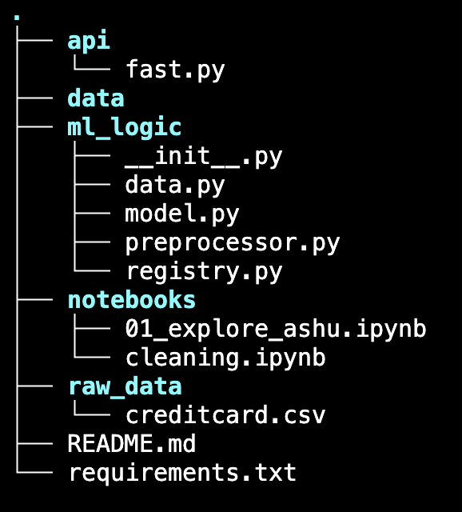
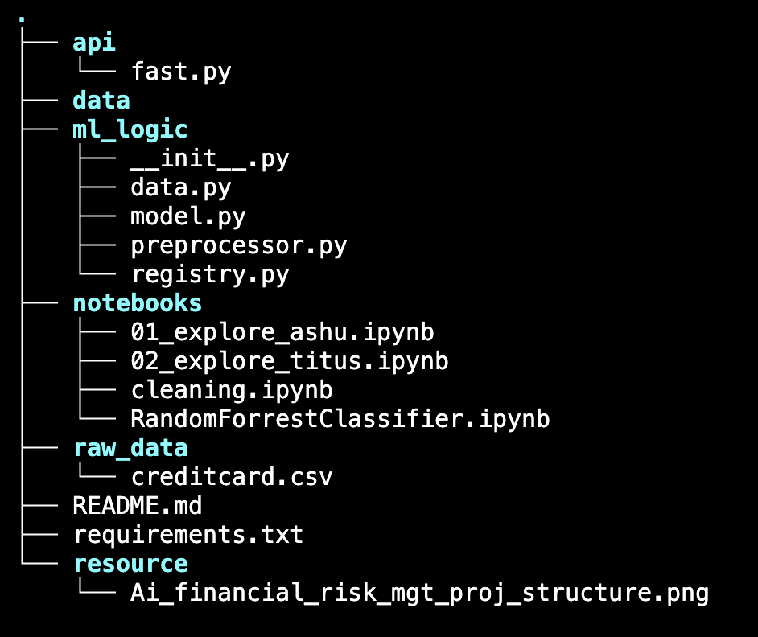
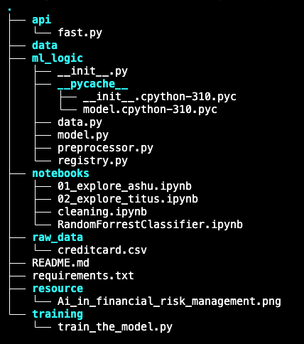
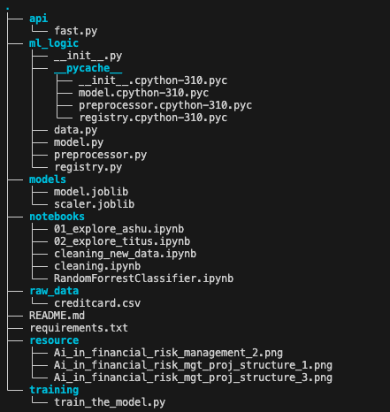
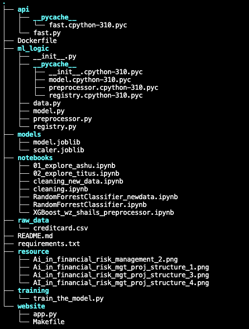

# Project-AI-Financial-Risk-Management
#### Project Summary

#### Fraud Detection Using Machine Learning

Our project focuses on building a robust machine learning pipeline to detect fraudulent financial transactions. The dataset contains 27 anonymized (hashed) features to preserve confidentiality, and the objective is to classify each transaction as fraudulent or legitimate.
We will experiment with three different machine learning models: `XGBoostClassifier`, `RandomForestClassifier`, `CatBoostClassifier`, `LogisticRegression`and we will applying a range of hyperparameter optimization techniques to systematically improve performance—particularly recall, which is critical in fraud detection. After finalizing the best-performing model, we will migrate the full workflow into a clean, modular Python codebase that follows production-grade structure and best practices.
Once the model is operational in code, we will containerize the application using Docker, ensuring reproducibility and ease of deployment. Finally, we will develop a user-friendly front-end interface using FastAPI and/or Streamlit, enabling real-time predictions and making the system accessible to end users through a cloud deployment.

#### Updated Approach and Current Challenges

We have transitioned to a new dataset featuring clearly named variables rather than anonymized features, which significantly improves model interpretability and enables meaningful user-facing explanations. This addresses our previous limitations regarding feature understanding and explanation transparency.

However, this new dataset presents a different technical challenge: with 1.3 million transactions, we need to implement an efficient data sampling and management strategy. Our current focus is developing a robust mechanism to:

1- Intelligently sample approximately 10% of the dataset while preserving class distribution and temporal patterns

2- Implement reshuffling capabilities to ensure model robustness across different data subsets

3- Maintain performance consistency between sampled data and the full dataset

We're exploring stratified sampling techniques, reservoir sampling algorithms, and distributed processing approaches to handle this volume efficiently while ensuring our fraud detection models remain accurate and generalizable across different data segments.

Finally, instead of limiting the training to a 10% subset of the data, we progressively leveraged the full dataset of approximately 1.3 million rows, and the model trained successfully without issues. Furthermore, after closely comparing the performance of the `XGBoostClassifier` and the `CatBoostClassifier`, we observed that both achieved similarly high results. However, for this specific dataset and task, `CatBoostClassifier` demonstrated slightly superior performance. Consequently, we chose to capitalize on CatBoost as the final modeling approach.

### Project in progress

#### Initial state of the project

#### Project in progress

#### Project in progress

#### Project while implimenting the frontend and backend

#### Current state of the project

